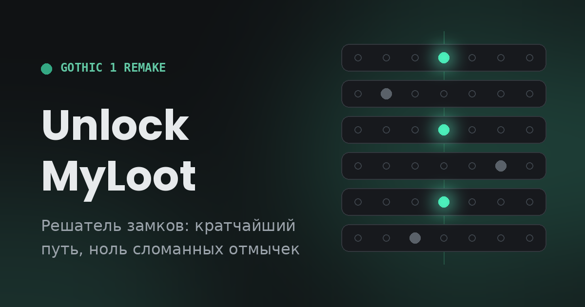

<div align="center">



# UnlockMyLoot

### Решатель замков для Gothic 1 Remake — кратчайший путь, ноль сломанных отмычек

[**unlockmyloot.com →**](https://unlockmyloot.com)


</div>

---

## Зачем это

Мини-игра взлома замков в Gothic 1 Remake — это головоломка-слайдер: у каждой плитки семь отверстий, штифт должен встать в центральное (позиция 4). Ловушка в том, что плитки связаны: двигаешь одну — едут другие, иногда в противоположную сторону. А любое движение в стену напрягает отмычку, и после пары ошибок она ломается.

UnlockMyLoot перебирает все состояния замка и выдаёт **кратчайшую последовательность ходов, в которой ни один штифт ни разу не упирается в стену**. Следуй шагам — отмычка целее, лут твой.

## Как пользоваться

Открой [сайт](https://unlockmyloot.com), дальше три шага:

1. **Количество плиток** — от 3 до 8, в игре обычно 6.
2. **Позиции штифтов** — кликни на текущее отверстие каждой плитки (счёт слева направо, центр — 4).
3. **Связи между плитками** — сдвинь в игре каждую плитку на шаг и верни обратно; отметь в матрице, кто дёрнулся и куда: в ту же сторону или в противоположную. Связи бывают односторонними.

Жми **«Взломать»** — получишь пронумерованные шаги с предпросмотром позиций после каждого хода. Выполненные шаги отмечаются кликом, конфигурацию замка можно отправить другу одной ссылкой.

## Как это работает

Состояние замка — вектор позиций штифтов, ход — сдвиг плитки с каскадом по связям. Решатель выполняет поиск в ширину (BFS) по всему пространству состояний (до 7⁸ ≈ 5,7 млн для 8 плиток), отбрасывая ходы, которые выводят любой штифт за границы [1, 7]. BFS гарантирует, что найденное решение — кратчайшее из безопасных. Перед выводом решение дополнительно прогоняется через независимую симуляцию.

Алгоритм проверен на реальных замках из игры (включая дверь башни Старого Лагеря) и на тысячах случайных конфигураций с перекрёстной проверкой оптимальности независимым алгоритмом.

## Запуск и деплой

Это один статический файл — сборка не нужна:

```bash
# локально: просто открой index.html в браузере
open index.html

# или подними локальный сервер
python3 -m http.server 8000
```

Деплой — на любой статический хостинг (GitHub Pages, Cloudflare, Netlify): загрузи `index.html` и `og.png` в корень. Для красивых превью в мессенджерах `og.png` должен быть доступен по адресу из OG-тегов в `<head>`.

## Авторство

Сайт создан YouTube-каналом [**108 seconds**](https://www.youtube.com/@1h8s).

Фанатский инструмент для [Gothic 1 Remake](https://gothicthegame.com/) (Alkimia Interactive / THQ Nordic). Не аффилирован с разработчиками или издателем — просто очень не хотелось ломать отмычки.
